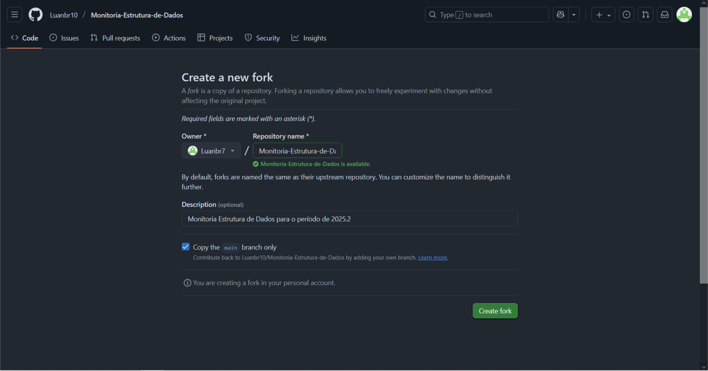
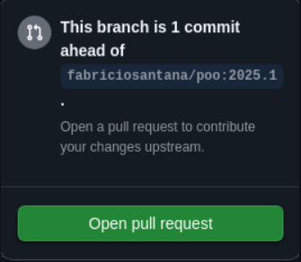

# 👨‍💻 Boas-vindas à Monitoria de Estrutura de Dados!
Olá, pessoal! Meu nome é Luan e sou o monitor de vocês na disciplina de Estrutura de Dados. Criei este repositório como um ponto central de apoio para a nossa jornada, com exercícios, aulas, material de apoio e etc. O objetivo aqui é simples: ajudar vocês a dominar os conceitos que transformam a maneira como resolvemos problemas com código. 

# 📘 Conteúdos
O desafio aqui é aprender a organizar dados de forma inteligente. O curso foca em dominar os trade-offs entre velocidade e memória para resolver problemas computacionais com a máxima performance. Juntos, vamos construir o caminho do conhecimento, passando por:

* Ponteiros e alocação dinâmica (malloc, calloc e realloc).
* Recursividade.
* Filas e Pilhas.
* Listas sequenciais e dinâmicas
* Árvores e Grafos.
* Algoritmos de ordenação e busca

# Instalando e Configurando o Git
---------------------------------
<h2>⚙️ Passo a Passo para Instalar e Configurar o Git</h2>
<h2>1. Verificar se o Git já está instalado:</h2>

Abra o terminal e digite:

```
git --version
```
Se retornar algo como git version 2.x.x, está tudo certo. Caso não tenha o git instalado, siga a instrução abaixo

---------------------------------
<h2>2. Instalar o Git:</h2>
<p>Windows: https://git-scm.com/download/win</p>
<p>macOS: https://git-scm.com/download/mac</p>
<p>Linux: sudo apt install git (Ubuntu/Debian)</p>

---------------------------------
<h2>3. Configurar o Git pela primeira vez:</h2>
Para verificar se seu git já está configurado, rode o comando:

```
git config --list
```
Caso não esteja:

```
git config --global user.name "Seu Nome"
// Execute o comando separado do outro
git config --global user.email "seu@email.com"
```

Exemplo de git já configurado


---------------------------------
# 🧭 Como Clonar o Repositório e Abrir um Pull Request
<h2>1. Criar seu fork:</h2>
Ao acessar a página principal do repositório da monitoria, você verá (no canto superior direito) um botão escrito fork.


Ao clicar nesse botão, crie o repositório:



---------------------------------
<h2>2. Clonar o repositório:</h2>

```
git clone <link do seu fork>
cd Monitoria-Estrutura-de-Dados (pode ser o nome do seu fork, mas sugiro não fazer alteração.)
Depois, adicione o repositório principal ao seu remotamente:
```

```
git remote add upstream https://github.com/samuka7abr/Monitoria-EDA.git
git remote -v
```
Você verá isso:


---------------------------------
<h2>3. Sincronizar com o repositório ANTES de fazer alterações:</h2>
Esse comando servirá para que seu fork tenha os mesmos arquivos do original. (esse mesmo que você está)

```
git pull upstream main
//execute um comando separado do outro
git push origin main
```
---------------------------------
<h2>4. Fazer alterações e subir para o GitHub:</h2>

```
git add .
git commit -m "resolvendo atividade X"
git push origin main
```
Esses commits e pushs mandarão suas alterações para o seu fork.

---------------------------------
<h2>5. Abrir o Pull Request</h2>
Vá ao seu Fork no GitHub
Clique em "Contribute" > "Open Pull Request"



Descreva brevemente o que foi resolvido e envie o Pull request. <br> Depois, avaliarei seu código e juntarei ao repisitório original.

----------------------------------
## 🎯 Seu Primeiro Passo: O Nivelamento

Para que eu possa entender melhor suas dificuldades e para que você mesmo(a) possa identificar seus pontos fortes e fracos, preparei um checklist de nivelamento.

**Instruções:**

1.  **Faça um Fork deste repositório:** ...
2.  **Acesse a pasta `aquecimento`:** ...
3.  **Siga as instruções do `README.md` de lá:** ...
4.  **IMPORTANTE:** Antes de entregar seus exercícios, leia nosso **[Guia de Contribuição e Entrega](./CONTRIBUTING.md)** para seguir o padrão correto.
----------------------------------

# 🧵 Canal da Monitoria (Discord)

A monitoria será transmitida ao vivo e o suporte será prestado pelo servidor oficial do Discord:

🔗 [discord.gg/d8fkh8vS5b](http://discord.gg/JTwkRGUsWH)

---------------------------------
Desejo a todos bons estudos. <br>
Luan Borges <br>
Monitoria de Estrutura de Dados - IDP <br>
